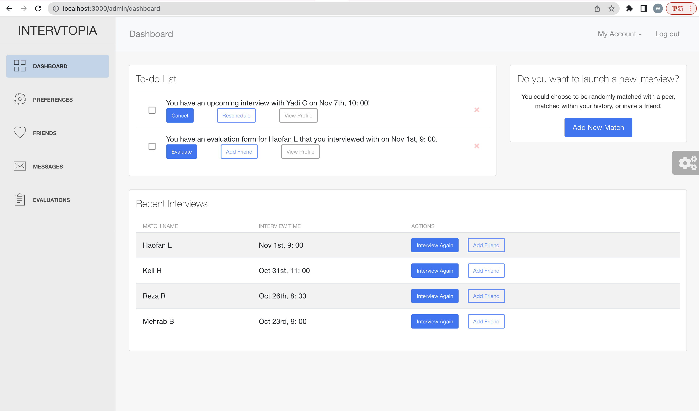

# Intervtopia-Frontend

## Table of Contents

- [Quick Start](#quick-start)
- [File Structure](#file-structure)
- [Current Progress](#current-progress)
- [References](#references)

## Quick Start

Follow these steps to quickly start development for intervtopia frontend:

- Install NodeJs from [NodeJs Official Page](https://nodejs.org/en/)
- Open Terminal, go to the "frontend" folder
- Run in terminal: `npm install`
- Then: `npm start`
- Navigate to `http://localhost:3000`, all your code changes will be shown on this webpage.

## File Structure

Most of our code are included in the `/src` folder, under which we have four folders:

- `/assets` contains the definitions of component styles, fonts and images used in the interface.
- `/components` contains the implementations of sidebar(at the left side of each page) and navigation bar(on the top of each page)
- `/layouts` contains the definition of page layout
- `/views` contains every page of our frontend and their detailed implementations, including dashboard, preferences setting, friends list, messages list, and evaluation forms.

Besides, there is an important file: `routes.js`, which defines the routing system of our frontend. When a user click a page name on the sidebar, the routing system will bring the user to the selected page.

## Current Progress

We have finished the implementation of sidebar, routing system, navigation bar, and dashboard page. We are currently working on the preferences page and friends page. We will start working on the evaluations page and messages page soon. 

For the part C, we will finish all the event handling parts of our frontend, as well as enable all the necessary data exchanges between frontend and backend.

## References

Our frontend is based on [ReactJS](https://reactjs.org/) and [React-Bootstrap](https://react-bootstrap.github.io/). We also adapted the dashboard templates and component styles created by [CreativeTim](https://github.com/creativetimofficial/light-bootstrap-dashboard-react) to accelerate our implementation.

